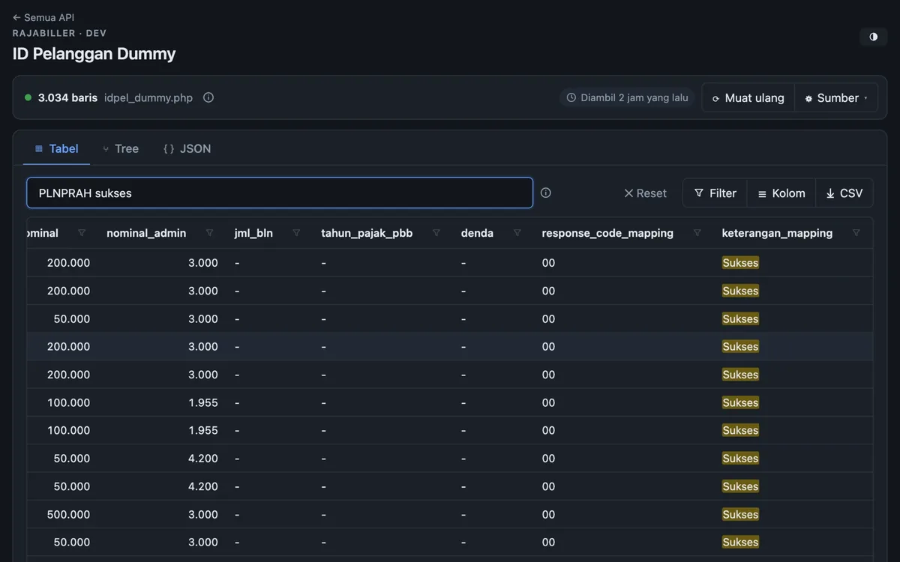

# API Listing Viewer — Search & Viewer untuk Data API Publik

> Tampilkan response JSON dari API publik sebagai **Table**, **Tree**, dan **JSON** — dengan filter lewat
> parameter API (hit ulang endpoint) maupun filter cepat di browser (pencarian, filter per kolom, sort, export CSV).
> Dibangun dengan **Vue 3 + Vite**.

### 🌐 Langsung pakai — tanpa setup

**👉 [https://rajabiller-dummy-id-pelanggan-searc.vercel.app/](https://rajabiller-dummy-id-pelanggan-searc.vercel.app/)**

Buka link di atas di browser, tidak perlu clone repo, `npm install`, atau menjalankan server sendiri.
Bagian **Menjalankan** di bawah hanya diperlukan jika ingin mengembangkan atau meng-host sendiri.



## Halaman

| URL | Isi | Penjelasan |
| --- | --- | --- |
| [`/`](https://rajabiller-dummy-id-pelanggan-searc.vercel.app/) | Halaman awal: daftar semua API viewer | — |
| [`/rajabiller-dummy-id-pelanggan/`](https://rajabiller-dummy-id-pelanggan-searc.vercel.app/rajabiller-dummy-id-pelanggan/) | ID pelanggan dummy Rajabiller untuk testing integrasi API PPOB / H2H — filter API: `prefix` | [docs/rajabiller-dummy-id-pelanggan.md](docs/rajabiller-dummy-id-pelanggan.md) |
| [`/daftar-universitas/`](https://rajabiller-dummy-id-pelanggan-searc.vercel.app/daftar-universitas/) | Daftar universitas dunia (Hipolabs Universities API) — filter API: `name`, `country`, `limit`, `offset` | [docs/daftar-universitas.md](docs/daftar-universitas.md) |

Semua halaman memakai fitur yang sama (lihat **Fitur**). Parameter API juga bisa diisi lewat URL halaman,
mis. `/daftar-universitas/?country=Indonesia&name=gorontalo` atau `/rajabiller-dummy-id-pelanggan/?prefix=PLNPRAH`.

## Menjalankan

> Tidak wajib — versi online sudah tersedia di https://rajabiller-dummy-id-pelanggan-searc.vercel.app/

```bash
npm install
npm run dev           # mode development → http://localhost:5173
```

Produksi:

```bash
npm run build         # hasil di dist/
npm start             # sajikan dist/ + proxy → http://localhost:8080
```

`dist/` juga bisa di-host di web server statis mana pun (base path relatif), namun tanpa proxy.

**Vercel**: proxy tersedia lewat serverless function `api/proxy.js` (`/proxy` di-rewrite ke
`/api/proxy` oleh `vercel.json`). Env `PROXY_HOSTS` bisa diset di Project Settings → Environment Variables.

Endpoint `/proxy?url=...` (tersedia di `npm run dev`, `npm run preview`, dan `npm start`) dipakai
sebagai cadangan bila browser memblokir request langsung karena CORS, dan langsung dipakai untuk endpoint
`http` saat halaman dibuka lewat `https` (*mixed content*). Proxy hanya mengizinkan host
`c-dev-api.rajabiller.com` dan `universities.hipolabs.com` (ubah lewat env `PROXY_HOSTS=host1,host2`).

Data juga bisa dimuat lewat tombol **Tempel JSON** / **File**.

Parameter URL halaman: parameter API sumber (`?prefix=PLNPRAH`, `?name=…&country=…`) dan `?url=<endpoint lain>` akan otomatis mengisi form.

## Struktur kode

```
index.html                halaman awal (root) — daftar API viewer
rajabiller-dummy-id-pelanggan/index.html   halaman viewer Rajabiller
daftar-universitas/index.html              halaman viewer daftar universitas
docs/                     penjelasan per halaman / sumber data
src/
  main.js                 entry halaman viewer (sumber dipilih dari data-source di #app)
  home.js, Home.vue       entry + tampilan halaman awal
  sources.js              konfigurasi tiap sumber data (endpoint, parameter API, key cache/preferensi)
  App.vue                 layout, tab, tema
  store.js                state global (reactive), fetch, filter, struktur tree otomatis
  lib/data.js             normalisasi JSON, parser filter, format & highlight
  lib/cache.js            cache response terakhir per sumber (IndexedDB), format waktu
  components/
    SourceBar.vue         form endpoint/parameter API, tempel JSON, upload file
    TableView.vue         tabel + search + filter per kolom + sort + pagination + CSV
    TreeView.vue          toolbar tree + konfigurasi struktur
    TreeNode.vue          node folder (rekursif, lazy render)
    TreeLeaves.vue        daftar item/leaf (dibatasi 300, ada "tampilkan lagi")
    JsonView.vue          response mentah
    DataInfo.vue          tab Info: keterangan sumber data + ringkasan isi data
    RowDetail.vue         modal detail baris (klik baris tabel / item tree)
    InfoTip.vue           tombol ⓘ untuk teks bantuan / detail panjang
  assets/style.css
public/favicon.svg        favicon (ikon tab browser)
proxy.js                  handler proxy CORS (dipakai vite.config.js & server.js)
server.js                 server produksi tanpa dependency
api/proxy.js              proxy untuk deploy di Vercel (serverless function)
vercel.json               rewrite /proxy → /api/proxy
```

## Fitur

**Table View**
- Pencarian global di semua kolom (beberapa kata = AND), hasil di-highlight.
- Filter per kolom: teks = mengandung, `=nilai` sama persis, `!teks` tidak mengandung,
  angka `>1000`, `<=5000`, `100..500`. Kolom dengan sedikit nilai unik punya saran (dropdown).
- Sort klik judul kolom (naik → turun → off), pagination, tampil/sembunyikan kolom,
  export CSV hasil filter, klik dua kali sel untuk copy.

**Tree View** (seperti "Category & Product Hierarchy")
- Grouping otomatis dari kolom bertipe kategori (prefix/produk/jenis/negara/…) atau dari
  key JSON bertingkat; bisa diatur manual lewat **⚙ Struktur** (level, label item, info kanan).
- Expand All / Collapse All, pencarian tree, opsi ikut filter tabel, badge kode & jumlah item,
  badge status hijau/merah.

**JSON View** — response mentah dengan syntax highlight + copy.

**Info** — keterangan sumber data (isi data, penyedia, asal data, endpoint, filter API, catatan) +
ringkasan data yang dihitung otomatis: jumlah baris & kolom, sebaran per grup (mis. per kategori / provinsi),
dan daftar kolom (tipe, % terisi, jumlah nilai unik, contoh nilai). Keterangan statis diisi lewat `about` di `src/sources.js`.

Response apa pun bentuknya dinormalisasi: array of object, `{status, data:[...]}`,
atau map bertingkat `{GRUP:{SUBGRUP:[...]}}` (key map menjadi kolom `Grup 1`, `Grup 2`, …).
Pengaturan (kolom tersembunyi, struktur tree, parameter API) disimpan di localStorage per halaman, tema dipakai bersama.
Response terakhir tiap sumber disimpan di browser (IndexedDB) supaya halaman langsung tampil saat dibuka lagi.

## Menambah API baru

Ketentuan standar lengkap untuk semua API viewer ada di [AGENTS.md](AGENTS.md).

1. Tambahkan entri di `src/sources.js` (endpoint, parameter API, `lsKey`, `cacheKey`, judul, dan `about` untuk tab **Info**).
2. Buat `<folder>/index.html` dengan `<div id="app" data-source="<id>">` (salin dari halaman yang ada, sesuaikan meta/SEO).
3. Daftarkan halaman di `build.rollupOptions.input` (`vite.config.js`).
4. Tambahkan host-nya ke `PROXY_HOSTS` default di `proxy.js` bila API tidak mengizinkan CORS atau hanya `http`.
5. Tambahkan kartunya di `src/Home.vue`, penjelasannya di `docs/<folder>.md`, dan barisnya di tabel **Halaman** di atas.
6. Opsional: screenshot kartu di `public/shots/<folder>.webp` (rasio 16:10, mis. 1200×750) lalu isi `image` di kartu; tanpa `image` kartu memakai placeholder bermotif.

## FAQ

**Kenapa request langsung ke endpoint gagal di browser?**
Biasanya karena CORS atau endpoint `http` dibuka dari halaman `https`. Aplikasi otomatis memakai endpoint
`/proxy` sebagai cadangan (lihat bagian Menjalankan).

**Apakah ini layanan resmi dari penyedia API-nya?**
Bukan. Ini tool bantu (unofficial) untuk developer. Lihat penjelasan tiap halaman di folder [`docs/`](docs/).

## Kata kunci

api viewer · json viewer · api listing · rajabiller · id pelanggan dummy · idpel dummy · data testing ppob ·
daftar universitas · university domains list · hipolabs universities api · Vue 3 · Vite
